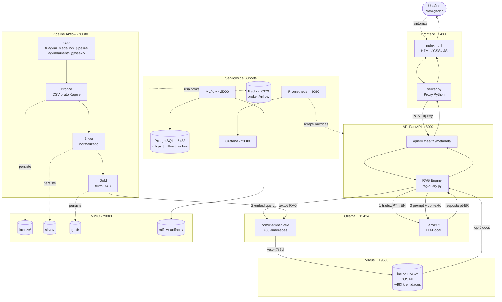

# Arquitetura — TriageAI

## Descrição Geral

O TriageAI é uma aplicação de triagem hospitalar baseada em RAG (Retrieval-Augmented Generation) totalmente containerizada. Toda a inferência — embeddings e geração de linguagem — é executada localmente via Ollama, eliminando dependência de APIs externas e protegendo dados clínicos. O sistema é composto por 14 serviços orquestrados via Docker Compose em uma rede interna `mlops-net`.

---

## Diagrama Arquitetural



---

## Tabela de Serviços

| Serviço | Imagem | Porta interna | Porta exposta | Papel |
|---------|--------|:---:|:---:|-------|
| `api` | `triageai-api` (build local) | 8000 | **8000** | Backend FastAPI — endpoint RAG |
| `frontend` | `triageai-frontend` (build local) | 7860 | **7860** | Serve HTML/JS e faz proxy para a API |
| `ollama` | `ollama/ollama` | 11434 | **11434** | LLM e geração de embeddings locais |
| `milvus` | `milvusdb/milvus:v2.4.5` | 19530 / 9091 | **19530** / **9091** | Banco de dados vetorial HNSW |
| `postgres` | `postgres:15` | 5432 | **5432** | Banco relacional (MLflow, Airflow, app) |
| `minio` | `minio/minio` | 9000 / 9001 | **9000** / **9001** | Object storage S3-compatível (dados + artefatos) |
| `minio-milvus` | `minio/minio` | 9000 / 9001 | **9010** / **9011** | MinIO dedicado ao Milvus |
| `airflow-webserver` | `apache/airflow:2.9.1` | 8080 | **8080** | Interface web do Airflow |
| `airflow-scheduler` | `apache/airflow:2.9.1` | — | — | Agendador de DAGs |
| `mlflow` | build local (Dockerfile.mlflow) | 5000 | **5000** | Tracking de experimentos e modelos |
| `jupyter` | build local | 8888 | **8888** | Notebooks (token: `mlops2025`) |
| `prometheus` | `prom/prometheus` | 9090 | **9090** | Coleta de métricas |
| `grafana` | `grafana/grafana` | 3000 | **3000** | Dashboards de observabilidade |
| `redis` | `redis:7` | 6379 | **6379** | Broker/cache do Airflow |
| `etcd` | `quay.io/coreos/etcd:v3.5.5` | 2379 | — | Coordenação interna do Milvus |

---

## Fluxos Detalhados

### (i) Consulta RAG — Fluxo em tempo real

```
Usuário digita sintomas no navegador
    → Frontend (index.html) via Fetch POST /query
    → Proxy Python (server.py :7860) encaminha para API
    → FastAPI (api/routes/triage.py) chama run_rag(symptoms)
    → rag/query.py:
        1. _translate_to_english(symptoms) → chama llama3.2 para traduzir PT→EN
        2. generate_embeddings([symptoms_en]) → nomic-embed-text gera vetor 768d
        3. search(embedding, top_k=5) → Milvus retorna top-5 documentos por COSINE
        4. build_prompt(symptoms, results) → monta system prompt + contexto clínico
        5. generate_response(messages) → llama3.2 gera resposta em português
    → Resposta retorna ao frontend como Markdown renderizado
```

### (ii) Pipeline de Ingestão Medallion — Airflow

```
@weekly (ou disparo manual)
    → Task ingestao_bronze:
        kagglehub.dataset_download() → CSV bruto salvo em s3://bronze/
    → Task processamento_silver:
        Normalização (lowercase, strip, extração de sintomas) → s3://silver/
    → Task processamento_gold:
        Geração do texto RAG em inglês → s3://gold/textos_rag.csv
    → Task atualizacao_milvus:
        Lê gold, gera embeddings em batches de 500 via nomic-embed-text
        → reset_collection() → insert_batch() → create_index_and_load()
        Resultado: coleção triageai_knowledge_base populada com ~493k entidades
```

### (iii) Treino de Modelos + MLflow

```
Jupyter Notebook (notebooks/training/treinamento_baseline.ipynb)
    → Lê s3://gold/textos_rag.csv via s3fs + MinIO
    → Treina pipeline TF-IDF + Modelo de Classificação
    → mlflow.set_experiment("triageai-baseline-oficial")
    → Loga parâmetros, métricas (accuracy, f1_score) e modelo
    → Artefatos persistidos em s3://mlflow-artifacts/ via MLflow
    → Comparativo entre modelos: notebooks/training/comparativo_modelos.ipynb
```

---

## Decisões Arquiteturais (ADR Resumida)

### Por que Milvus?
Milvus é um banco vetorial open-source de alta performance com suporte nativo a índice HNSW e métricas de similaridade (COSINE, L2, IP). Permite indexar centenas de milhares de vetores e realizar buscas em milissegundos, viabilizando RAG em tempo real sem latência perceptível para o usuário.

### Por que Ollama local?
Dados clínicos são sensíveis (LGPD — dado de saúde). Usar Ollama on-premise garante que nenhum sintoma ou resposta seja transmitido a APIs externas (OpenAI, Anthropic, etc.). O modelo `nomic-embed-text` (768d) e o `llama3.2` rodam inteiramente na máquina do hospital.

### Por que MinIO + Arquitetura Medallion?
MinIO é S3-compatível e pode rodar on-premise sem custo de cloud. A arquitetura medallion (Bronze/Silver/Gold) separa dados brutos, processados e prontos para uso, facilitando reprocessamento, auditoria e governança sem perder a fonte original.

### Por que FastAPI?
FastAPI oferece validação automática de contratos via Pydantic, geração de documentação Swagger sem configuração adicional e performance assíncrona nativamente. É o padrão de facto para APIs ML em Python.

### Por que Frontend como Proxy Separado?
O frontend (HTML/JS puro) roda no navegador e não pode resolver hostnames Docker internos (como `api:8000`). O proxy Python (`server.py`) resolve esse problema: o navegador faz chamadas para `localhost:7860/query`, e o proxy encaminha para `http://api:8000/query` dentro da rede `mlops-net`. Isso permite usar um frontend estático simples sem dependências externas (sem Node.js, sem build step).
